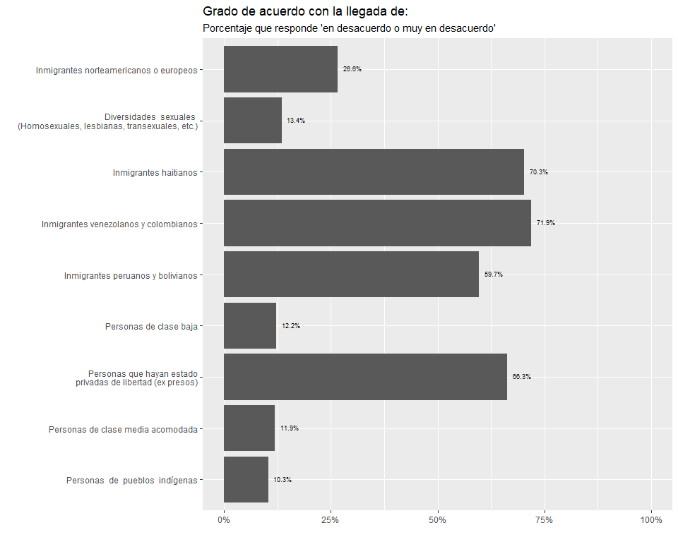

\newpage


```
## [1] "C:/Users/crist/OneDrive - Universidad Católica de Chile/Investigación y proyectos/[COES] Linea 4/analisis-datos/cohesion-renca/2_processing"
```

# 1. Relación con la comuna y el barrio

## Apego al barrio


## Sociabilidad 


### Apoyo social


### Visitas


### Confianza


## Confianza en autoridades e instituciones comunales


## Arraigo físico


## Participación


## Actividad civica


## Grupos de nuevos residentes



## Justificación violencia


# 2. Conocimiento de iniciativas municipales y autoridades

## Medios de información:


## Evaluación infraestructura y programas municipales


## Conocimiento autoridades


# 3. Evaluación gestión municipal

## Evaluación de la Municipalidad de Renca


## Evaluación elementos del barrio


## Evaluación infrestructura y equipamiento barrial


## Evaluación servicios municipales


# 4. Proyección futuro

## Fortalezas


## Renca en tres años


## Principales problemas


# 5. Seguridad

## Reputación barrial


## Seguridad en el barrio


# 6. Caracterización sociodemográfica


