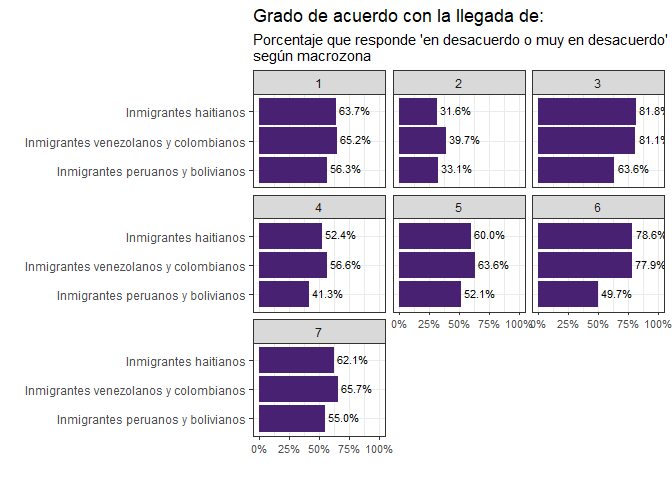
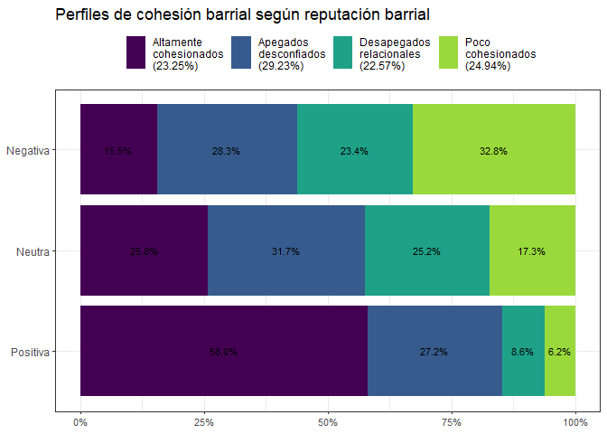
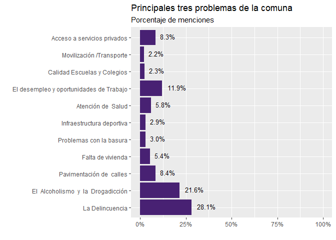

# 1. Caracterización de macrozonas y población 

## Macrozonas


# 2. La cohesión en perspectiva comparada

## 2.1. Indicadores de cohesión barrial horizontal

### a. Apego al barrio


### b. Arraigo físico


```
## x <numeric> 
## # total N=800 valid N=760 mean=2.94 sd=0.90
## 
## Value |   N | Raw % | Valid % | Cum. %
## --------------------------------------
##     1 |  73 |  9.12 |    9.61 |   9.61
##     2 | 115 | 14.37 |   15.13 |  24.74
##     3 | 357 | 44.62 |   46.97 |  71.71
##     4 | 215 | 26.88 |   28.29 | 100.00
##  <NA> |  40 |  5.00 |    <NA> |   <NA>
```


### c. Sociabilidad barrial


### d. Confianza en vecinos


### e. Participación local**


### f. Apoyo social


## 2.2. Cohesión barrial vertical

### a. Confianza en autoridades e instituciones de la comuna

### b. Participación en organizaciones de la comuna


### c. Activida cívica

```
## Asistido a alguna reunión donde se traten temas de interés público o comunitario (x) <numeric> 
## # total N=982 valid N=982 mean=1.72 sd=0.49
## 
## Value |        Label |   N | Raw % | Valid % | Cum. %
## -----------------------------------------------------
##     1 |           Sí | 291 | 29.63 |   29.63 |  29.63
##     2 |           No | 673 | 68.53 |   68.53 |  98.17
##     3 | NS (no leer) |  16 |  1.63 |    1.63 |  99.80
##     4 | NR (no leer) |   2 |  0.20 |    0.20 | 100.00
##  <NA> |         <NA> |   0 |  0.00 |    <NA> |   <NA>
```


## 2.3. Tolerancia a la diversidad




# 3. Perfiles de cohesión barrial en Renca





# 4. Factores relacionados a la cohesión

## 4.2. Seguridad


## 4.3. Reputación 


# 5. Evaluación del municipio

## 5.1. Gestión municipal

### a. Evaluación de la gestión municipal


### b. Evaluación de los servicios municipales


### c. Evaluación de infreaestructura comunal


### d. Evaluación de programas comunales


## 5.2. Evaluación del entorno barrial

### a. Evaluación de los elementos del barrio


### b. Evaluación de infraestructura y equipamiento barrial


## 5.3 Actualidad y proyección comunal

### a. Fortalezas


### b. Problemas



### c. Proyección en tres años


